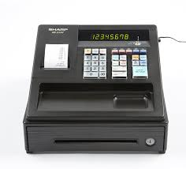

## Make Change Project

This project simulates a cash register. A user is asked to enter an item amount. The user then enters the amount.

The program will calculate the change returned by largest denomination. 

### For example: 
*Cost of item .
*100.
*Tendered amount.
*110
*1 one dollar bills.
*1 dimes.
*The change is 10.0.

This is Week 1 [Skill Distillery](http://skilldistillery.com) weekend homework.

### Technologies Used
* Java
* Git command line
* Eclipse

### Lessons Learned
* Doubles in Java are tricky
* Uploading and styling README

